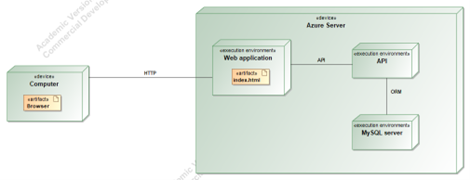

# T120B165 Saityno taikomųjų programų projektavimas

## Sistemos paskirtis

Projekto tikslas – palengvinti skrydžių paiešką.

Veikimo principas – pačią kuriamą platformą sudaro dvi dalys: internetinė aplikacija, kuria naudosis lankytojai, administratorius, bei aplikacijų programavimo sąsaja (angl. trump. API).

Svečias galės ieškoti skrydžių ir jei norės užsakyti, tada galės prisiregistruoti.

---

## Funkciniai reikalavimai

Svečias galės:

1. Peržiūrėti pagrindinį puslapį;
2. Ieškoti skrydžių;
3. Prisijungti ir prisiregistruoti prie internetinės aplikacijos.

Registruotas sistemos naudotojas galės:

1. Atsijungti nuo internetinės aplikacijos;
2. Ieškoti skrydžių;
3. Užsakyti skrydį;
4. Atšaukti skrydį;

Administratorius galės:

1. Patvirtinti naudotojo registraciją;
2. Pridėti naujus skrydžius;
3. Pridėti naujus lėktuvus;
4. Šalinti naudotojus;
5. Pridėti administratorius.

---

## Sistemos architektūra

Sistemos sudedamosios dalys:

- Kliento pusė (angl. Front-End) – naudojant Vue;
- Serverio pusė (angl. Back-End) – naudojant Laravel. Duomenų bazė – PostgreSQL.

1 pav. pavaizduota kuriamos sistemos diegimo diagrama. Sistemos talpinimui yra naudojamas Azure serveris. Kiekviena sistemos dalis yra diegiama tame pačiame serveryje. Internetinė aplikacija yra pasiekiama per HTTP protokolą.

---

## API Specifikacija

### Airport

|                     |                        |
| ------------------- | ---------------------- |
| HTTP metodas        | GET                    |
| Paskirtis           | Gauti visus oro uostus |
| URI                 | `/api/airports/`       |
| Užklausos struktūra | -                      |
| Užklausos _header_  | -                      |
| Užklausos atsakymas | <pre lang="json">[   {     "id": 1,     "name": "Block LLC",     "address": "603 Mable Keys\nDareberg, CT 77469",     "code": "ODTU\/AKA",     "created_at": "2022-10-08T17:39:02.000000Z",     "updated_at": "2022-10-08T17:39:02.000000Z"   }, ... ]</pre> |
| Atsakymo kodas | 200 (OK) |
| Klaidų kodai | <ul><li>404 - Nerasta oro uostų</li></ul> |

|                     |                        |
| ------------------- | ---------------------- |
| HTTP metodas        | GET                    |
| Paskirtis           | Gauti oro uostą pagal ID |
| URI                 | `/api/airports/{id}`       |
| Užklausos struktūra | -                      |
| Užklausos _header_  | -                      |
| Užklausos atsakymas | <pre lang="json">{   "id": 1,   "name": "Block LLC",   "address": "603 Mable Keys\nDareberg, CT 77469",   "code": "ODTU\/AKA",   "created_at": "2022-10-08T17:39:02.000000Z",   "updated_at": "2022-10-08T17:39:02.000000Z" }</pre> |
| Atsakymo kodas | 200 (OK) |
| Klaidų kodai | <ul><li>404 - Nerastas oro uostas</li></ul> |

|                     |                        |
| ------------------- | ---------------------- |
| HTTP metodas        | POST                    |
| Paskirtis           | Sukurt naują oro uostą |
| URI                 | `/api/airports/`       |
| Užklausos struktūra | <pre lang="json">{   "name": "test_name",   "address": "test_address",   "code": "test_code" }</pre> |
| Užklausos _header_  | <pre lang="json">{     "X-Requested-With": "XMLHttpRequest" }</pre> |
| Užklausos atsakymas | <pre lang="json">{   "id": 1,   "name": "Block LLC",   "address": "603 Mable Keys\nDareberg, CT 77469",   "code": "ODTU\/AKA",   "created_at": "2022-10-08T17:39:02.000000Z",   "updated_at": "2022-10-08T17:39:02.000000Z" }</pre> |
| Atsakymo kodas | 201 (Created) |
| Klaidų kodai | <ul><li>422 - Bloga užklausa</li></ul> |

|                     |                        |
| ------------------- | ---------------------- |
| HTTP metodas        | PUT                    |
| Paskirtis           | Atnaujinti oro uostą |
| URI                 | `/api/airports/{id}`       |
| Užklausos struktūra | <pre lang="json">{   "name": "test_name_updated",   "address": "test_address_updated",   "code": "test_code_updated" }</pre> |
| Užklausos _header_  | <pre lang="json">{     "X-Requested-With": "XMLHttpRequest" }</pre> |
| Užklausos atsakymas | <pre lang="json">{   "id": 8,   "name": "test_name_updated",   "address": "test_address_updated",   "code": "test_code_updated",   "created_at": "2022-10-08T17:45:09.000000Z",   "updated_at": "2022-10-08T18:00:01.000000Z" }</pre> |
| Atsakymo kodas | 200 (OK) |
| Klaidų kodai | <ul><li>404 - Nerastas oro uostas</li><li>422 - Bloga užklausa</li></ul> |

|                     |                        |
| ------------------- | ---------------------- |
| HTTP metodas        | DELETE                    |
| Paskirtis           | Ištrinti oro uostą |
| URI                 | `/api/airports/{id}`       |
| Užklausos struktūra | - |
| Užklausos _header_  | - |
| Užklausos atsakymas | - |
| Atsakymo kodas | 200 (OK) |
| Klaidų kodai | <ul><li>404 - Nerastas oro uostas</li></ul> |

### Flight

|                     |                        |
| ------------------- | ---------------------- |
| HTTP metodas        | GET                    |
| Paskirtis           | Gauti visus skrydžius |
| URI                 | `/api/flights/`       |
| Užklausos struktūra | -                      |
| Užklausos _header_  | -                      |
| Užklausos atsakymas | <pre lang="json">[   {     "id": 1,     "code": "rb9156",     "gate": "w6",     "duration": "11:53:31",     "departure_time": "2014-07-05 19:20:22",     "arrival_time": "2019-07-01 07:12:10",     "price": "153.43",     "departure_id": 4,     "arrival_id": 5,     "created_at": "2022-10-08T17:39:02.000000Z",     "updated_at": "2022-10-08T17:39:02.000000Z"   }, ... ]</pre> |
| Atsakymo kodas | 200 (OK) |
| Klaidų kodai | <ul><li>404 - Nerasta skrydžių</li></ul> |

|                     |                        |
| ------------------- | ---------------------- |
| HTTP metodas        | GET                    |
| Paskirtis           | Gauti skrydį pagal ID |
| URI                 | `/api/flights/{id}`       |
| Užklausos struktūra | -                      |
| Užklausos _header_  | -                      |
| Užklausos atsakymas | <pre lang="json">{     "id": 1,     "code": "rb9156",     "gate": "w6",     "duration": "11:53:31",     "departure_time": "2014-07-05 19:20:22",     "arrival_time": "2019-07-01 07:12:10",     "price": "153.43",     "departure_id": 4,     "arrival_id": 5,     "created_at": "2022-10-08T17:39:02.000000Z",     "updated_at": "2022-10-08T17:39:02.000000Z" }</pre> |
| Atsakymo kodas | 200 (OK) |
| Klaidų kodai | <ul><li>404 - Nerastas skrydis</li></ul> |

|                     |                        |
| ------------------- | ---------------------- |
| HTTP metodas        | POST                    |
| Paskirtis           | Sukurt naują skrydį |
| URI                 | `/api/flights/`       |
| Užklausos struktūra | <pre lang="json">{   "code": "test_code",   "gate": "test_gate",   "duration": "08:25:01",   "departure_time": "2022-10-08 12:12:12",   "arrival_time": "2022-10-09 12:12:12",   "departure_id": "1",   "arrival_id": "2",   "price": "10.5" }</pre> |
| Užklausos _header_  | <pre lang="json">{     "X-Requested-With": "XMLHttpRequest" }</pre> |
| Užklausos atsakymas | <pre lang="json">{   "code": "test_code",   "gate": "test_gate",   "duration": "08:25:01",   "departure_time": "2022-10-08 12:12:12",   "arrival_time": "2022-10-09 12:12:12",   "departure_id": "1",   "arrival_id": "2",   "price": "10.5",   "updated_at": "2022-10-08T18:58:52.000000Z",   "created_at": "2022-10-08T18:58:52.000000Z",   "id": 18 }</pre> |
| Atsakymo kodas | 201 (Created) |
| Klaidų kodai | <ul><li>422 - Bloga užklausa</li></ul> |

|                     |                        |
| ------------------- | ---------------------- |
| HTTP metodas        | PUT                    |
| Paskirtis           | Atnaujinti skrydį |
| URI                 | `/api/flights/{id}`       |
| Užklausos struktūra | <pre lang="json">{   "code": "test_code",   "gate": "test_gate",   "duration": "08:25:01",   "departure_time": "2022-10-08 12:12:12",   "arrival_time": "2022-10-09 12:12:12",   "departure_id": "4",   "arrival_id": "3",   "price": "10.5" }</pre> |
| Užklausos _header_  | <pre lang="json">{     "X-Requested-With": "XMLHttpRequest" }</pre> |
| Užklausos atsakymas | <pre lang="json">{   "code": "test_code",   "gate": "test_gate",   "duration": "08:25:01",   "departure_time": "2022-10-08 12:12:12",   "arrival_time": "2022-10-09 12:12:12",   "departure_id": "4",   "arrival_id": "3",   "price": "10.5",   "updated_at": "2022-10-08T18:58:52.000000Z",   "created_at": "2022-10-08T18:58:52.000000Z",   "id": 15 }</pre> |
| Atsakymo kodas | 200 (OK) |
| Klaidų kodai | <ul><li>404 - Nerastas skrydis</li><li>422 - Bloga užklausa</li></ul> |

|                     |                        |
| ------------------- | ---------------------- |
| HTTP metodas        | DELETE                    |
| Paskirtis           | Ištrinti skrydį |
| URI                 | `/api/fligths/{id}`       |
| Užklausos struktūra | - |
| Užklausos _header_  | - |
| Užklausos atsakymas | - |
| Atsakymo kodas | 200 (OK) |
| Klaidų kodai | <ul><li>404 - Nerastas skrydis</li></ul> |

### Plane

|                     |                        |
| ------------------- | ---------------------- |
| HTTP metodas        | GET                    |
| Paskirtis           | Gauti visus lėktuvus |
| URI                 | `/api/planes/`       |
| Užklausos struktūra | -                      |
| Užklausos _header_  | -                      |
| Užklausos atsakymas | <pre lang="json">[   {     "id": 2,     "model": "qxiqw",     "seats": "484",     "flight_id": 2,     "created_at": "2022-10-08T17:39:02.000000Z",     "updated_at": "2022-10-08T17:39:02.000000Z"   }, ... ]</pre> |
| Atsakymo kodas | 200 (OK) |
| Klaidų kodai | <ul><li>404 - Nerasta lėktuvų</li></ul> |

|                     |                        |
| ------------------- | ---------------------- |
| HTTP metodas        | GET                    |
| Paskirtis           | Gauti lėktuvą pagal ID |
| URI                 | `/api/planes/{id}`       |
| Užklausos struktūra | -                      |
| Užklausos _header_  | -                      |
| Užklausos atsakymas | <pre lang="json">{     "id": 8,     "model": "kbmnm",     "seats": "932",     "flight_id": 8,     "created_at": "2022-10-08T17:39:02.000000Z",     "updated_at": "2022-10-08T17:39:02.000000Z"   }</pre> |
| Atsakymo kodas | 200 (OK) |
| Klaidų kodai | <ul><li>404 - Nerastas lėktuvas</li></ul> |

|                     |                        |
| ------------------- | ---------------------- |
| HTTP metodas        | POST                    |
| Paskirtis           | Sukurt naują lėktuvą |
| URI                 | `/api/planes/`       |
| Užklausos struktūra | <pre lang="json">{   "model": "test",   "seats": "50",   "flight_id": "5" }</pre> |
| Užklausos _header_  | <pre lang="json">{     "X-Requested-With": "XMLHttpRequest" }</pre> |
| Užklausos atsakymas | <pre lang="json">{   "model": "test",   "seats": "50",   "flight_id": "5",   "updated_at": "2022-10-08T19:28:43.000000Z",   "created_at": "2022-10-08T19:28:43.000000Z",   "id": 11 }</pre> |
| Atsakymo kodas | 201 (Created) |
| Klaidų kodai | <ul><li>422 - Bloga užklausa</li></ul> |

|                     |                        |
| ------------------- | ---------------------- |
| HTTP metodas        | PUT                    |
| Paskirtis           | Atnaujinti lėktuvą |
| URI                 | `/api/planes/{id}`       |
| Užklausos struktūra | <pre lang="json">{   "model": "test",   "seats": "50",   "flight_id": "5" }</pre> |
| Užklausos _header_  | <pre lang="json">{     "X-Requested-With": "XMLHttpRequest" }</pre> |
| Užklausos atsakymas | <pre lang="json">{   "model": "test",   "seats": "50",   "flight_id": "5",   "updated_at": "2022-10-08T19:28:43.000000Z",   "created_at": "2022-10-08T19:28:43.000000Z",   "id": 1 }</pre> |
| Atsakymo kodas | 200 (OK) |
| Klaidų kodai | <ul><li>404 - Nerastas lėktuvas</li><li>422 - Bloga užklausa</li></ul> |

|                     |                        |
| ------------------- | ---------------------- |
| HTTP metodas        | DELETE                    |
| Paskirtis           | Ištrinti lėktuvą |
| URI                 | `/api/planes/{id}`       |
| Užklausos struktūra | - |
| Užklausos _header_  | - |
| Užklausos atsakymas | - |
| Atsakymo kodas | 200 (OK) |
| Klaidų kodai | <ul><li>404 - Nerastas lėktuvas</li></ul> |
